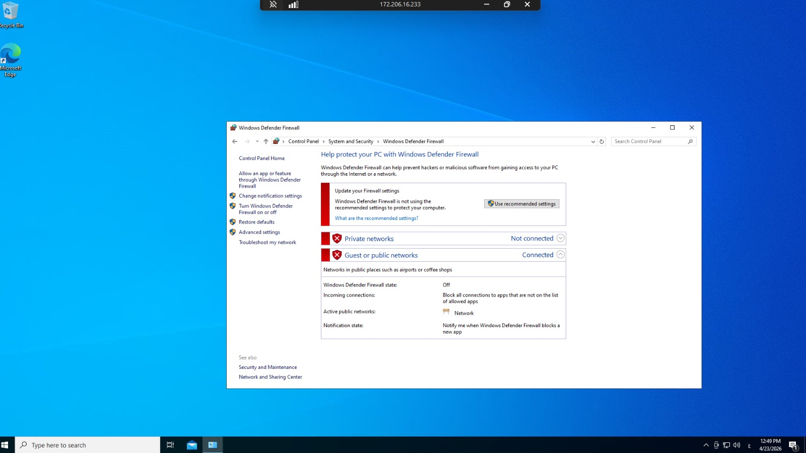
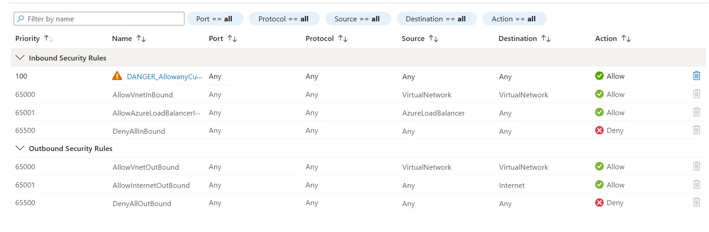

# Azure Sentinel Honeypot Lab

## Overview

This project demonstrates a fully implemented cloud-based honeypot using Microsoft Azure and Microsoft Sentinel to detect and analyze real-world cyber attacks.

A Windows Virtual Machine was intentionally exposed to the internet to attract malicious activity. Security logs were collected, analyzed, and visualized using Microsoft Sentinel and KQL.

## Project Objectives

* Deploy a vulnerable Windows VM (Honeypot)
* Capture real-world failed login attempts (RDP attacks)
* Analyze attacker behavior using KQL
* Visualize global attack sources using an attack map
* Simulate real SOC (Security Operations Center) workflow

## Technologies Used

* Microsoft Azure
* Microsoft Sentinel (SIEM)
* Log Analytics Workspace
* Windows Virtual Machine
* Kusto Query Language (KQL)
* Remote Desktop Protocol (RDP)

## Lab Architecture

.jpeg)

## Honeypot Configuration



## Network Security Group (NSG)



## Attack Visualization


## Sample KQL Query

```kql id="x1kql9"
SecurityEvent
| where EventID == 4625
| summarize FailedAttempts = count() by IpAddress
| order by FailedAttempts desc
```

## Key Results

* Successfully captured multiple failed login attempts from different countries
* Identified attacker IP addresses and patterns
* Visualized attack data using Microsoft Sentinel
* Demonstrated basic threat detection and analysis

## Skills Gained

* SIEM configuration (Microsoft Sentinel)
* Log analysis and investigation
* KQL querying
* Cyber threat detection
* Cloud security fundamentals
* SOC analyst workflow

## Status

✅ Completed

## Author

Mohmmad Aldhfeeri
